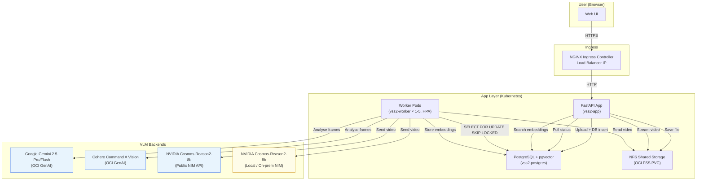

# VSS2 Architecture — Video Search & Summarization

## Overview

VSS2 is a cloud-native video intelligence platform that combines:

- **Vision-Language Models (VLMs)** for per-frame visual understanding
- **Kubernetes HPA** for elastic parallel processing
- **pgvector** for semantic similarity search
- **fastembed** for lightweight, local text embeddings
- **OCI GenAI** for multi-model inference without managing GPU infrastructure

The system is designed to be **stateless at the API layer** and **horizontally scalable at the analysis layer**, making it suitable for both interactive demos and production workloads.

---

## Component Diagram



---

## Data Flow

### Upload & Analysis

```
1. User uploads video via browser
2. API receives file → saves to FSS → inserts DB row (status=pending)
3. API responds immediately: {"videoId": "...", "status": "pending"}
4. Worker pod polls DB: SELECT ... FOR UPDATE SKIP LOCKED
5. Worker claims job: status=analysing, worker_id=pod-name
6. Worker extracts frames: ffmpeg at 1fps → JPEG list
7. Worker calls VLM API in batches of 24 frames
8. Worker embeds each analysis chunk: fastembed BAAI/bge-small-en-v1.5
9. Worker stores chunks + vectors in pgvector
10. Worker sets status=ready
11. Frontend polls /api/videos/{id}/status every 3s — shows progress
```

### Semantic Search

```
1. User types a natural-language query
2. API embeds the query: fastembed (same model as worker)
3. pgvector cosine similarity search across all ready video chunks
4. Top-k results returned with similarity scores + timestamps
5. (Optional) OCI GenAI LLM synthesises a narrative answer from top results
6. User can click "Jump to 42s" — video player seeks to that timestamp
```

---

## Key Design Decisions

### Why separate App and Worker pods?

The API needs fast response times (< 100ms for uploads, status checks, searches). VLM analysis takes 2–20 minutes per video. Running analysis in-process would:
- Block API threads
- Make the app non-scalable (can't add replicas independently)
- Lose progress on pod restart

By separating concerns, the API remains stateless and the workers can be independently scaled.

### Why `SELECT FOR UPDATE SKIP LOCKED`?

Standard SELECT + UPDATE introduces a race condition where two workers can claim the same job. `SKIP LOCKED` is a PostgreSQL feature that atomically skips rows already locked by another transaction — perfect for a lightweight job queue without an external broker (no Redis, no RabbitMQ needed).

### Why fastembed instead of an embedding API?

- **No network call**: embeddings run locally in each pod (384-dim vectors, ~50ms)
- **Consistent vectors**: query embeddings and chunk embeddings use the same model
- **NFS cache**: the model is downloaded once and shared via the FSS PVC

### Why OCI GenAI?

OCI GenAI provides managed endpoints for Gemini, Cohere, and other models with:
- **Instance Principal auth**: no API key management in the cluster
- **Pay-per-token pricing**: no GPU infrastructure to manage
- **Multiple models**: swap VLMs per video without redeploying

### Why NVIDIA Cosmos-Reason2?

Cosmos-Reason2-8b is purpose-built for video understanding. Unlike generic VLMs that accept images, Cosmos accepts raw video bytes and reasons about temporal dynamics natively. It is available as:
- **Public NIM**: immediate access via NVIDIA API key
- **Local NIM**: run on your own GPU nodes for data sovereignty

---

## Horizontal Scaling

The HPA monitors CPU utilisation on the `vss2-worker` deployment:

| Condition | Action |
|-----------|--------|
| CPU > 70% for 30s | Add 2 worker replicas |
| CPU < 70% for 5m | Remove 1 worker replica |
| Min replicas | 1 (always running) |
| Max replicas | 5 |

Each worker is CPU-bound on two operations:
1. **ffmpeg frame extraction** — scales linearly with video length
2. **fastembed inference** — ~50ms per chunk, runs on CPU

When multiple videos are uploaded simultaneously, CPU spikes and the HPA immediately adds workers. Each new worker pod picks up the next unclaimed job from the queue.

---

## Database Schema

```sql
-- Video metadata and job tracking
CREATE TABLE vss2_videos (
    id TEXT PRIMARY KEY,
    filename TEXT NOT NULL,
    video_path TEXT NOT NULL,
    vlm_model TEXT NOT NULL,
    scenario TEXT NOT NULL DEFAULT 'general',
    custom_prompt TEXT DEFAULT '',
    camera_id TEXT DEFAULT '',
    location TEXT DEFAULT '',
    capture_type TEXT DEFAULT '',
    status TEXT NOT NULL DEFAULT 'pending',  -- pending | analysing | ready | error
    batch_done INTEGER DEFAULT 0,
    total_batches INTEGER DEFAULT 0,
    frames INTEGER DEFAULT 0,
    duration FLOAT DEFAULT 0.0,
    error_msg TEXT DEFAULT '',
    started_at TIMESTAMPTZ,
    worker_id TEXT DEFAULT '',
    upload_timestamp TIMESTAMPTZ DEFAULT NOW()
);

-- Vector embeddings for semantic search
CREATE TABLE vss2_chunks (
    id SERIAL PRIMARY KEY,
    video_id TEXT NOT NULL REFERENCES vss2_videos(id) ON DELETE CASCADE,
    chunk_index INTEGER NOT NULL,
    chunk_text TEXT NOT NULL,
    segment_start FLOAT DEFAULT 0.0,
    segment_end FLOAT DEFAULT 0.0,
    embedding vector(384),    -- BAAI/bge-small-en-v1.5
    UNIQUE(video_id, chunk_index)
);

-- HNSW index for fast cosine similarity search
CREATE INDEX vss2_chunks_emb_idx
ON vss2_chunks USING hnsw (embedding vector_cosine_ops)
WITH (m = 16, ef_construction = 64);
```
